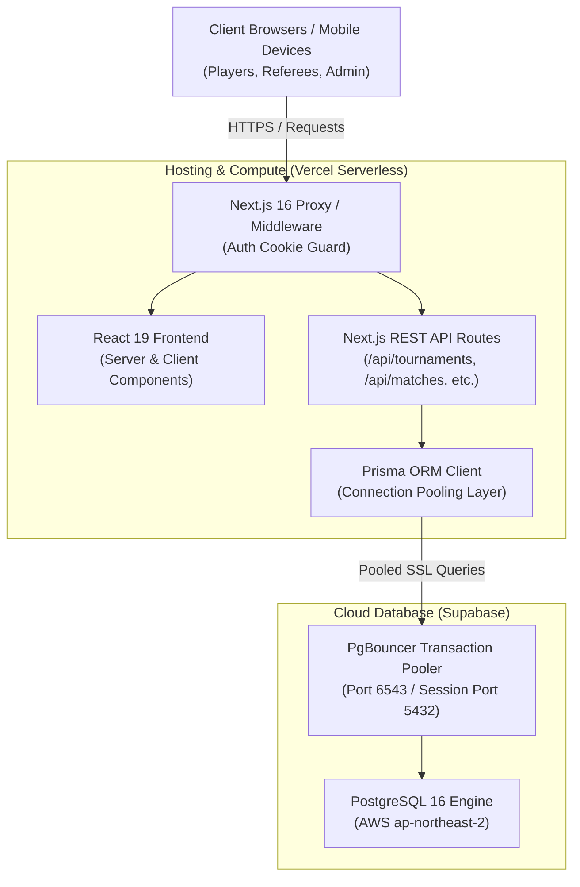
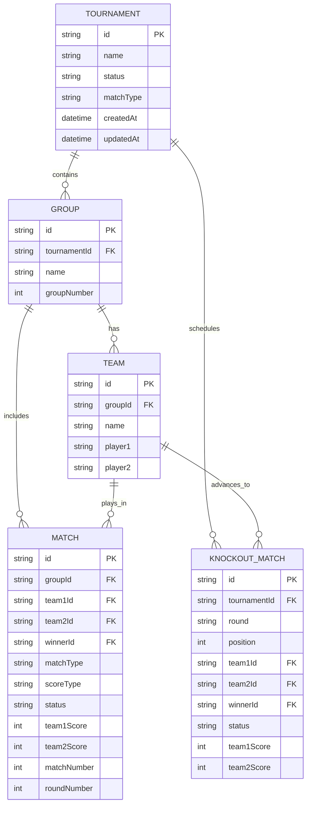

# 🏓 Pickleball Tournament Manager — Tech Stack Document

An architectural overview of the technologies, libraries, services, and system design powering the Pickleball Tournament Manager.

---

## 🏛️ System Architecture

---

## 1. Frontend Layer

| Technology | Version | Purpose & Rationale |
| :--- | :--- | :--- |
| **Next.js (App Router)** | `16.3.5` | React framework providing server-side rendering (SSR), optimized client bundling with **Turbopack**, and unified routing for both UI pages and REST endpoints. |
| **React** | `19.2.8` | Component-based UI library leveraging modern hooks (`useState`, `useCallback`, `useParams`, `useRouter`) for reactive state transitions. |
| **Vanilla CSS / Design System** | Native CSS3 | Zero-runtime CSS design system built with custom CSS variables, sleek dark theme, glassmorphism cards, responsive grids, and micro-animations. Eliminates external CSS overhead. |
| **Next.js Image Optimization** | `next/image` | Automatic image optimization, WebP compression, lazy loading, and LCP prevention for assets like logos. |

---

## 2. Backend & API Layer

| Technology | Description |
| :--- | :--- |
| **Next.js Route Handlers** | Serverless API routes (`src/app/api/...`) handling JSON payloads for tournaments, matches, knockout brackets, and authentication. |
| **Next.js 16 Proxy / Middleware** | [`src/proxy.ts`](file:///c:/Users/Aniket/.gemini/antigravity-ide/scratch/pickleball-tournament/src/proxy.ts) acts as an edge guard, intercepting unauthorized requests and redirecting them to `/login` with return parameters. |
| **Authentication** | Cookie-based session management (`pickleball_session`) utilizing HTTP-only, SameSite-restricted cookies with 24-hour expiration. |
| **Scoring Engine** | [`src/lib/scoring.ts`](file:///c:/Users/Aniket/.gemini/antigravity-ide/scratch/pickleball-tournament/src/lib/scoring.ts) validates pickleball rule constraints: minimum winning thresholds (11, 15 rally, 21), win-by-2 differentials, and calculates live round-robin standings. |

---

## 3. Database & ORM Layer

| Component | Technology | Configuration & Details |
| :--- | :--- | :--- |
| **Primary Database** | **PostgreSQL 16** *(Supabase Cloud)* | Fully relational ACID-compliant database hosted in Seoul (`ap-northeast-2`), storing tournaments, groups, teams, round-robin matches, and knockout matches. |
| **Connection Pooling** | **PgBouncer** | Port `6543` transaction pooler for ultra-low latency serverless connection reuse on Vercel; Port `5432` session pooler for direct migrations. |
| **ORM** | **Prisma ORM (`v5.22.0`)** | Type-safe database client, declarative schema modeling ([`prisma/schema.prisma`](file:///c:/Users/Aniket/.gemini/antigravity-ide/scratch/pickleball-tournament/prisma/schema.prisma)), relational joins, and automated migration management. |
| **Embedded Dev DB** | **SQLite** *(Optional local)* | Embedded relational option (`prisma/dev.db`) allowing zero-dependency local development when working offline. |

---

## 4. Data Models & Entity Relationships

---

## 5. Hosting & Deployment

| Platform | Role | Configuration |
| :--- | :--- | :--- |
| **Vercel** | Production Host & Serverless Compute | Connects to GitHub; runs Turbopack production builds; executes API route lambdas on-demand. |
| **Supabase** | Managed Cloud PostgreSQL Database | Handles database queries with connection pooling, automatic failover, and persistent storage. |
| **CI/CD Build Script** | `package.json` | `"postinstall": "prisma generate"` guarantees Prisma Client compiles automatically during Vercel deployments. |

---

## 6. Language & Developer Tooling

* **Language**: TypeScript 5 with strict typing across database models, API contracts, and React component props.
* **Code Quality**: ESLint 9 with Next.js core Web Vitals config.
* **Local Containerization**: Docker Compose configuration (`docker-compose.yml`) for optional local PostgreSQL instance.
* **Package Manager**: npm with package-lock pinning.
